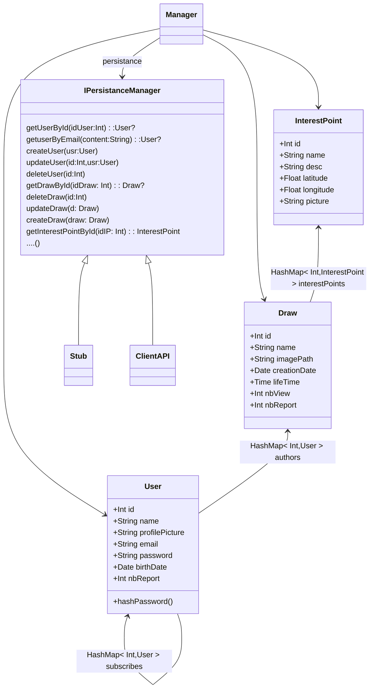

Class Diagram : (class library)
===

```mermaid
classDiagram

class User{
        +Int id
        +String name
        +String profilePicture
        +String email
        +String password
        +Date birthDate
        +Int nbReport
        +hashPassword()
    }

class InterestPoint{
        +Int id
        +String name
        +String desc
        +Float latitude
        +Float longitude
        +String picture
}

class Draw{
        +Int id
        +String name
        +String imagePath
        +Date creationDate
        +Time lifeTime
        +Int nbView
        +Int nbReport
}

class Manager{
    
}

class IPersistanceManager{
    getUserById(idUser:Int):User?
    getuserByEmail(content:String):User?
    createUser(usr:User)
    updateUser(id:Int,usr:User)
    deleteUser(id:Int)
    getDrawById(idDraw: Int): Draw?
    deleteDraw(id:Int)
    updateDraw(d: Draw)
    createDraw(draw: Draw)
    getInterestPointById(idIP: Int): InterestPoint
    ....()
}

class Stub{
    
}

class ClientAPI{
    
}
Manager --> InterestPoint
Manager --> Draw
Manager --> User
Manager --> IPersistanceManager : persistance
IPersistanceManager <|-- Stub
IPersistanceManager <|-- ClientAPI
User <-- User : HashMap< Int,User > subscribes
Draw <-- User : HashMap< Int,User > authors
InterestPoint <-- Draw : HashMap< Int,InterestPoint > interestPoints

```

